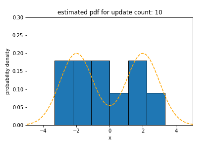
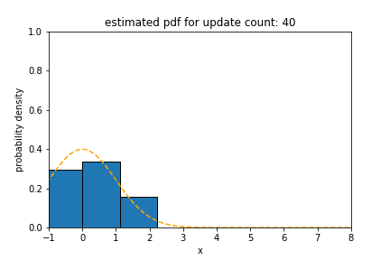

# Flip 🎲

[](https://travis-ci.org/xxxnell/flip)
[](https://codecov.io/gh/xxxnell/flip)
[](https://waffle.io/xxxnell/flip)
[  ](https://bintray.com/xxxnell/oss-maven/flip/_latestVersion)


*Flip* is *F*ast, *L*ightweight pure-functional library for *I*nformation theory and *P*robability distribution. *Flip* aims to extract and process statistical features of the input data stream in a short time using only small memory. It has the following features:

* Quicly estimate and summarize probability distribution for random variable stream using `Sketch`
* Combine several probability distributions by probability monad
* Generate random variables from many predefined and estimated probability disributions 
* Measure similarity between two probability distribution using Kullback–Leibler divergence


## Getting Started

*Flip* is published to jCenter and built for Scala 2.12, so you can add the following to your `build.sbt`:

``` scala
resolvers += Resolver.jcenterRepo

libraryDependencies += "com.xxxnell" %% "flip" % "0.0.2"
```


## Summarizing Random Variable Stream using `Sketch`

`Sketch` is the probablistic data structure that quickly measures the probalility density for the real number random variable data stream with limited memory without prior knowledge. Simply put, `Sketch` is a special histogram in which the width of each bin is adaptively adjusted to the input data stream, unlike conventional histograms, which require the user to specify the width and start/end point of the bin. It follows the change of probability distribution, and adapts to the sudden/gradual [concept drift](https://en.wikipedia.org/wiki/Concept_drift). Also, more then two `Sketch` can be combined in monadic way. This is what we call the probability monad in functional programming. `Sketch` is better alternative to [kernel density estimation](https://en.wikipedia.org/wiki/Kernel_density_estimation) and [histogram](https://en.wikipedia.org/wiki/Histogram) in most cases.

Here is an example of how `Sketch` estimates the density using the dataset sampled from the standard normal distribution.

``` scala 
import flip.implicits._

// get 100 random variables from standard normal distribution
val underlying = NumericDist.normal(0.0, 1.0)
val (_, samples) = underlying.samples(100)

// update samples to sketch
val sketch0 = Sketch.empty[Double]
val utdSketch = samples.foldLeft(sketch0) {
  case (sketch, sample) => sketch.update(sample)
}

// get probability for interval [0.0, 1.0]
println("result: " + utdSketch.probability(0.0, 1.0))
println("expected: " + underlying.probability(0.0, 1.0))
// result: 0.35479611850109305
// expected: 0.34134474606854304
```


### The case of bimodal distribution

Here is an experiment result for a bimodal probabability density function consisting of two standard normal distributions centered at -2 and 2.



In this figure, the dashed orange line is the expected underlying probability distribution, and the blue bar is the probability distribution which `Sketch` estimates. `Sketch` assumes an initial bin with a uniform width, and estimates the first optimal bin at the update count of 50. Then `Sketch` estimates new bins every 100 data updates, for example, 50, 150, 250, and so on.


### The case of concept drift

Sketch also adapts well to any type of concept drift. Here is an experiment result under the situation where the distribution that `Sketch` should estimate is gradually changing over time. The underlying distribution starts to change when the update count is 300 and moves by +0.01 per update count. `Sketch` is predicting this moving distribution well, although ther is some lag. And this lag can be reduced by adjusting the sensitivity to new data.



In all of these experiments, I did not give any prior knowledge to predict the underlying distirbution well. It works well with the default configuration. For more example, see the [experiment](./flip-docs/experiment.md) documentation. If you want to learn how to use `Sketch` in a real world, see the [codes for these experiments](./flip-bench/src/main/scala/flip/experiment).


## Contributing

Contributions are always welcome. Any kind of contribution, such as writing a unit test, documentation, bug fix, or implementing [the density estimation algorithm of `Sketch`](./flip-docs/algorithm.md) in another language, is helpful. If you need some help, please contact me via [email](mailto:xxxxxnell@gmail.com) or [twitter](https://twitter.com/xxxnell).

Fo more detail, see the [contributing](./CONTRIBUTING.md) documentation.


## License

All code of *Flip*  is available to you under the [MIT license](./LICENSE). 

Copyright the maintainers.

