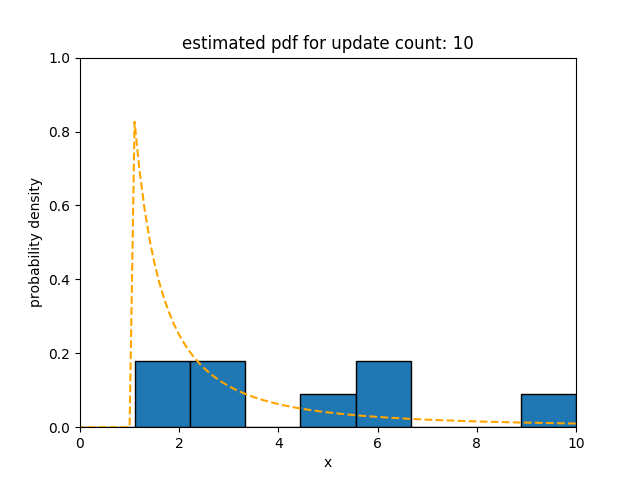
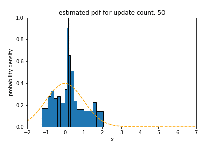

# Welcome to the Flip 🎲  Documentation

This `README` will walk you through navigating the Flip documentation.

Flip is Fast, Lightweight pure-functional library for Information theory and Probability distribution. Flip aims to extract and process statistical features of the input data stream in a short time using only small memory. Especially, it is essential that Flip estimates and summarizes the density of the data stream. By statistical processing using the estimated and summarized probability distribution, various statistical features can be handled with fewer resources.
 
Flip can be used to accurately estimate the probability density, regardless of what characteristics a random variable stream follows. The followings are some selected examples: a bimodal distribution, a pareto with long tail, a gradual concept drift that changes its statistical properties gradually, and a sudden concept drift.

If you want to ckeck more experiment results of Flip, see the [experiment](./experiment.md) documentation. For the performance of Flip, see the [benchmark](./benchmark.md) documentation. See the [algorithm](./algorithm.md) documentation to understand how Flip works.